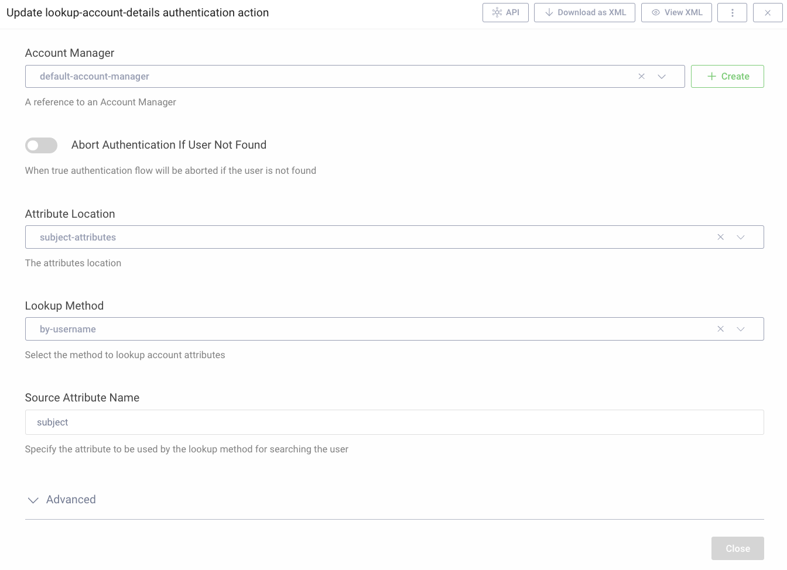

Lookup Account Authentication Action Plugin
=============================================

.. image:: https://img.shields.io/badge/quality-production-green
   :target: https://curity.io/resources/code-examples/status/
   :alt: Quality

.. image:: https://img.shields.io/badge/availability-source-blue
   :target: https://curity.io/resources/code-examples/status/
   :alt: Availability

A custom authentication action plugin for the Curity Identity Server. You can add this action to any curity authenticator to fetch the user's account attributes from the underlying datasource.

Building the Plugin
~~~~~~~~~~~~~~~~~~~

Build the plugin by issuing the command ``mvn package``. This will produce a JAR file in the ``target`` directory,
which can be installed.

Installing the Plugin
~~~~~~~~~~~~~~~~~~~~~

To install the plugin, copy the compiled JAR (and all of its dependencies) into the :file:`${IDSVR_HOME}/usr/share/plugins/${pluginGroup}`
on each node, including the admin node. For more information about installing plugins, refer to `curity.io/plugins`_.

Required Dependencies
"""""""""""""""""""""

You need at least version 7.3.0 of the Curity Identity Server to use this plugin.

For a list of the dependencies and their versions, run ``mvn dependency:list``. Ensure that all of these are installed in
the plugin group. Otherwise, they will not be accessible to this plug-in and run-time errors will result.

Configuring the Plugin
~~~~~~~~~~~~~~~~~~~~~~

You need to configure the following options for the plugin:

.. list-table::
   :widths: 25 25 50
   :header-rows: 1

   * - Configuration
     - Mandatory
     - Description
   * - Account Manager
     - Yes
     - The Account manager that will be used to retrieve the user's account attributes from the datasource
   * - Abort Authentication If User Not Found
     - No
     - The Action plugin aborts the authentication flow if the looked up user is not found in the underlying datasource
   * - Attribute Location
     - No
     - The location where the looked-up account attributes should be added
   * - Source Attribute Name
     - No
     - The attribute to be used by the lookup method for searching the user
   * - Lookup Method
     - No
     - The method to be used for looking up the user. Supported methods are ``BY_USERNAME, BY_EMAIL, BY_PHONE``

More Information
~~~~~~~~~~~~~~~~

Please visit `curity.io`_ for more information about the Curity Identity Server.

.. _curity.io/plugins: https://support.curity.io/docs/latest/developer-guide/plugins/index.html#plugin-installation
.. _curity.io: https://curity.io/
